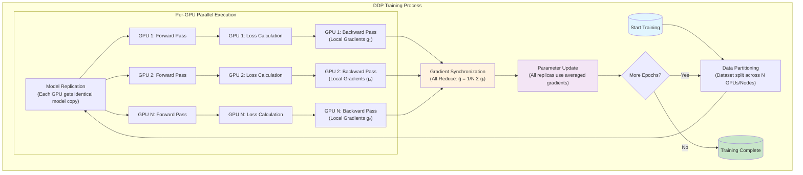

# Distributed Data Parallel (DDP)

## What is the Distributed Data Parallel (DDP)?

**Definition:** The Distributed Data Parallel (DDP) is a technique in PyTorch
that allows for training deep learning models across multiple GPUs and nodes.
It enables faster training and better utilization of resources by distributing
the workload across multiple devices.

We have two types implemented of the Distributed Data Parallel (DDP) in PyTorch:

1. **Multi-GPU in a single node:** This approach allows for training a model onmultiple GPUs within a single machine. It is suitable for scenarios where you have access to a powerful machine with multiple GPUs.
2. **Multi-Node DDP:** This approach involves training a model across multiple machines, each with one or more GPUs. It is suitable for scenarios where you have access to a cluster of machines with GPUs.

Comparison to Other Parallelization Techniques:

- **DataParallel** (single-process, multi-thread) is limited to a single machine and is generally slower due to Python’s Global Interpreter Lock (GIL) and extra overhead.
- **Model Parallelism:** Model Parallelism splits the model itself across devices, useful for extremely large models but more complex to implement.

**When to use DDP:**

- When you have multiple GPUs or nodes available for training (increase of computational power).
- When you want to reduce the training time of your deep learning models
(especially for large-scale models or datasets).
- _MUST USE:_ When you want to train a model which is too large to fit into a single GPU memory (e.g., LLMs).

## Pros and Cons of the Distributed Data Parallel (DDP)

**Pros:** Advantages of Distributed Data Parallel

- _Scalability:_ Easily scales training across many GPUs and machines, achieving near-linear speedup as more resources are added.
- _Faster Training:_ Reduces time to convergence for large models and datasets by parallelizing computation.
- _Efficient Resource Utilization:_ Maximizes hardware usage, preventing bottlenecks and idle GPUs.
- _Consistency:_ Synchronous updates ensure all model replicas remain identical, leading to stable and reliable training.
- _Flexibility:_ Can be used on a single machine with multiple GPUs or across multiple machines in a cluster.

**Cons:** Challenges and Considerations in Distributed Data Parallel (DDP)

- _Communication Overhead:_ Synchronizing gradients across GPUs can slow down training, especially with large models or many devices.
- _Network Bandwidth:_ Distributed setups require fast, reliable networking to avoid bottlenecks during data and gradient exchange.
- _Complex Implementation:_ Setting up and managing DDP across multiple machines and GPUs involves careful configuration and error handling.
- _Cost:_ Operating a distributed system with multiple GPUs and nodes can be expensive in terms of hardware, maintenance, and energy consumption.
- _Fault Tolerance:_ Failures in nodes or GPUs can interrupt or halt training, requiring robust checkpointing and recovery strategies.

## How do DDP works?

### Summary of the normal Deep Learning (DL) training process

The typical training process for deep learning models involves the following steps:

1. **Data Loading:** Load the training data in batches.
2. **Forward Pass:** Pass the input data through the model to obtain predictions.
3. **Loss Calculation:** Compute the loss by comparing predictions with ground truth labels.
4. **Backward Pass:** Calculate gradients of the loss with respect to model parameters using backpropagation.
5. **Parameter Update:** Update model parameters using an optimization algorithm (e.g., SGD, Adam).

### How DDP modifies the training process

In Distributed Data Parallel (DDP), the training process is modified to enable parallelism across multiple GPUs or nodes. The key changes include:

1. **Data Partitioning:** The training dataset is divided into smaller subsets, and each GPU or node processes a different subset of the data. (This is the place where the data parallelism comes into play, as each replica of the model works on a different portion of the dataset which increases the training speed and efficiency.)
2. **Model Replication:** Each GPU or node maintains a replica of the model, ensuring that all replicas start with the same initial parameters.
3. **Forward Pass:** Each replica performs the forward pass independently on its assigned data subset.
4. **Loss Calculation:** Each replica computes the loss based on its predictions and ground truth labels.
5. **Backward Pass:** Each replica computes gradients independently during the backward pass. After the backward pass, each replica has its own set of gradients for the model parameters. How can we ensure that all replicas have the same gradients? The solutions is using the Bucketed Ring All-Reduce algorithm.
6. **Gradient Synchronization:** After the backward pass, gradients from all replicas are synchronized across GPUs or nodes. This is typically done using an all-reduce operation, which averages the gradients across all replicas ($\bar{g} = \frac{1}{N} \sum_{i=1}^{N} g_i$ with $N$ being the number of replicas).
7. **Parameter Update:** Once gradients are synchronized, each replica updates its model parameters using the averaged gradients, ensuring that all replicas remain consistent.

## Core Terminology of DDP

- Node: Refers to a single computational machine in your setup. This could be a physical server in a rack or a virtual machine instance in the cloud. A node typically contains one or more processing units (CPUs, GPUs).
- Process / Worker: An independent instance of your Python training script running on a node. In typical GPU based training, you often launch one process per GPU to maximize hardware utilization. These processes execute concurrently and need to coordinate.
- Rank: A unique integer identifier assigned to each process participating in the distributed computation. Ranks typically range from `0` to `N-1`, where `N` is the total number of processes involved. By convention, rank 0 often has special responsibilities, like logging or saving checkpoints, although this isn't a strict requirement.
- Size: The total number, `N`, of processes cooperating in the distributed training job. If you are training across 4 nodes, each with 8 GPUs, and running one process per GPU, the size is $4 × 8 = 32$.
- Process Group: A defined subset of all processes (the group). By default, all processes belong to a single group. However, PyTorch allows creating subgroups, which is useful for more complex parallelism schemes like hybrid data and model parallelism, where different types of communication might happen among different sets of workers.
- Backend: The underlying communication library that facilitates message passing between processes. PyTorch's torch.distributed package supports several backends:
  - NCCL (NVIDIA Collective Communications Library): The preferred backend for GPU based training on NVIDIA hardware. It's highly optimized for inter GPU communication, both within a node (using NVLink) and across nodes (using network interfaces like InfiniBand or Ethernet).
  - Gloo: A platform agnostic backend that works for CPU based communication and communication between GPUs across different node types or network setups where NCCL might not be optimal or available. It also supports GPUs but is generally slower than NCCL for GPU collectives.
  - MPI (Message Passing Interface): A standard for high performance computing communication. Can be used if your cluster environment is already configured for MPI, but NCCL or Gloo are more common within the PyTorch ecosystem.

## Conclusion

In summary, Distributed Data Parallel (DDP) is a powerful technique in PyTorch that enables efficient training of deep learning models across multiple GPUs and nodes. By distributing the workload and synchronizing gradients, DDP allows for faster training times, better resource utilization, and scalability. However, it also comes with challenges such as communication overhead and complexity in implementation. Understanding the core concepts and terminology of DDP is essential for effectively leveraging this technique in your deep learning projects.
